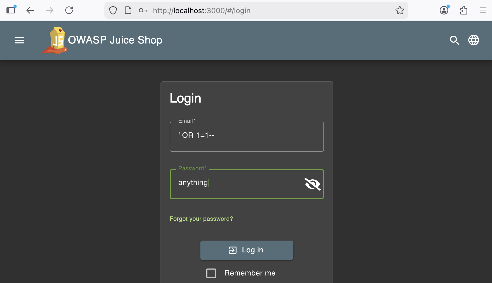
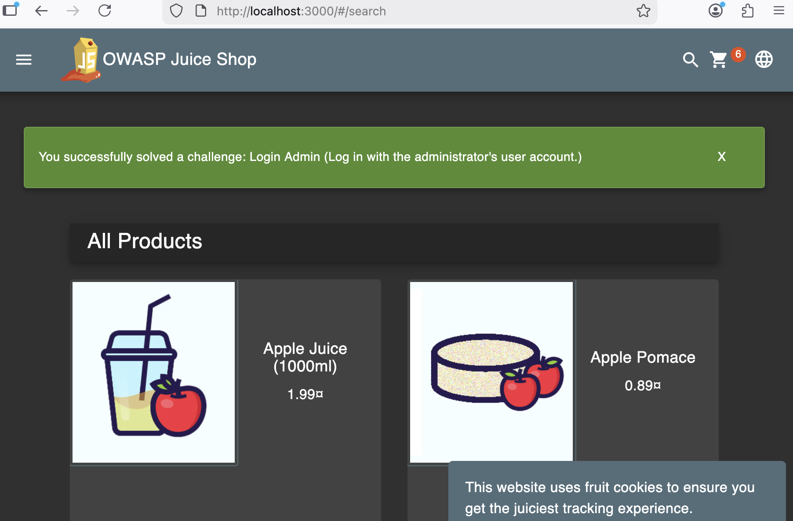

## SQL Injection (Authentication Bypass)

**Category:** OWASP A05:2025 Injection

## Tools Used
- OWASP Juice Shop (Docker)
- Burp Suite Community
- Browser

**Description:**  
The login endpoint fails to validate user input, allowing SQL injection to bypass authentication.

**Steps to Reproduce:**
1. Started Juice Shop using Docker
2. In search bar entered `http://localhost:3000`
3. Navigate to the login page under Account
4. Enter `' OR 1=1--` as the email
5. Enter any password, I used `anything`
6. Click login
7. Successfully bypassed authentication

**Evidence:**
- Intercepted POST request to `/rest/user/login`
- Application granted access without valid credentials

**Impact:**  
An attacker can gain unauthorized access to user accounts.

**Mitigation:**  
Use parameterized queries and proper input validation.

**Injection Payload**
'''json
{
  "email":"' OR 1=1--",
  "password":"anything"
}

## Proof (Screensots)

### SQL Injection Payload

### Successful Authentication Bypass

### Intercepted POST Request (Burp Suite)

